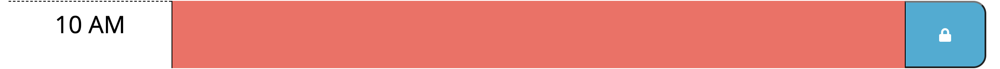
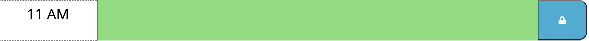
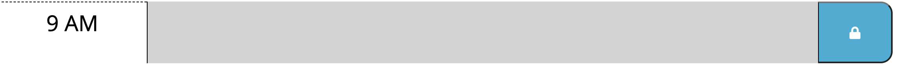
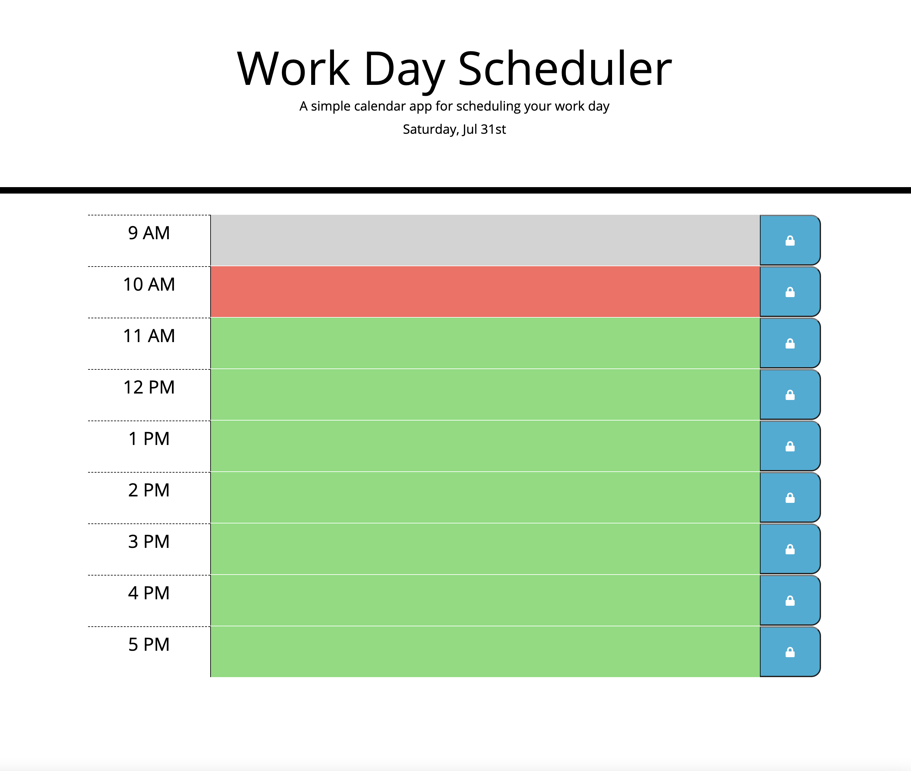

# Day Planner

## Plan and organize your daily schedule and tasks with this helpful tool!

## Features:
 This Scheduler is color coded to easily identify the current, future and past hours.

 #### Current Hours:

 Are a REDISH color. 

 

 #### Future Hours:

  Are GREEN in color. 
  

 #### Past Hours:
  
  Are GRAY in color. 
  

 You can also add text to a hour (section) and store it!

 ## How to store text:

 1. Enter text by clicking in the colored area. 

 2. Click the blue button with the lock to store the text.

 Note: If the blue button is not pressed the text will NOT be stored.

# Technologies used

1. jQuery
2. CSS
3. HTML

 # Website 
 

## Contact Info 

KarenHarley88@gmail.com
 

 ### Links:
 

#### Github

`https://github.com/KarenHarley/Day-Planner`

#### Website

`https://karenharley.github.io/Day-Planner/`

